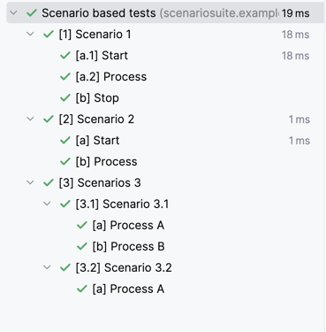
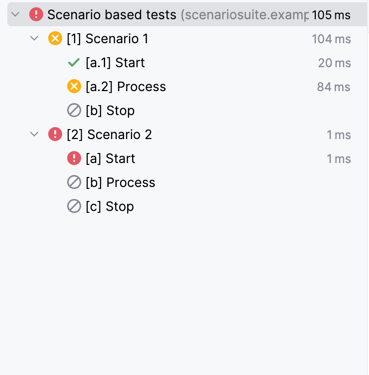

# Scenario Suite for JUnit 5

## Writing a scenario suite

```java
@ScenarioSuite("Scenario based tests")
public class SimpleScenarioSuiteTest {
    @Scenario("Scenario 1")
    class _1 {
        @Step("Start")
        void a_1() {
        }

        @Step("Process")
        void a_2() {
        }

        @Step("Stop") // Sucesss
        void b() {
        }
    }

    @Scenario("Scenario 2")
    class _2 {
        @Step("Start")
        void a() {
        }

        @Step("Process")
        void b() {
        }
    }

    @ScenarioGroup("Scenarios 3")
    class _3 {
        @Scenario("Scenario 3.1")
        class _3_1 {
            @Step("Process A")
            void a() {
            }

            @Step("Process B")// Success
            void b() {
            }
        }

        @Scenario("Scenario 3.2")
        class _3_2 {
            @Step("Process A")
            void a() {
            }
        }
    }
}
```

The result in the IDE such as IntelliJ will look like the following.



## Skipping steps after failure

Steps after a failure in a scenario will be skipped.

```java
@ScenarioSuite("Scenario based tests")
public class SimpleFailingScenarioSuiteTest {
    @Scenario("Scenario 1")
    class _1 {
        @Step("Start")
        void a_1() {
        }

        @Step("Process")
        void a_2() {
            assertThat(false).isTrue();
        }

        @Step("Stop") // Sucesss
        void b() {
        }
    }

    @Scenario("Scenario 2")
    class _2 {
        @Step("Start")
        void a() {
            throw new RuntimeException();
        }

        @Step("Process")
        void b() {
        }

        @Step("Stop")
        void c() {
        }
    }
}
```

The result in the IDE such as IntelliJ will look like the following.


